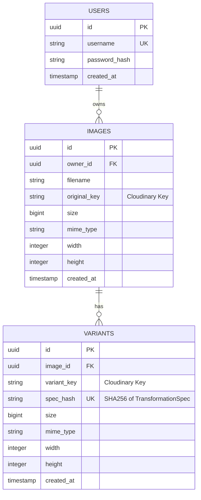

# Database Schema Design

The service uses a relational schema designed for high-performance metadata retrieval and variant deduplication.

## 📊 Entity Relationship Diagram

## 📝 Table Definitions

### `users`
Stores user profile and credentials.
- `username`: Unique index for efficient lookup during login.

### `images`
Stores metadata for original uploaded images.
- `owner_id`: Indexed for fast pagination of user image lists.
- `original_key`: Path or ID in Object Storage.

### `variants`
Stores metadata for transformed versions of an image.
- `spec_hash`: A unique SHA256 hash of the `TransformationSpec` (JSON). 
- **Deduplication**: A unique index on `(image_id, spec_hash)` ensures that we never process the same transformation twice for the same image, saving compute and storage costs.

## 🚀 Performance Optimizations
- **Indexes**: Applied to `owner_id` (Images) and `image_id` (Variants) to support common query patterns.
- **Unique Constraints**: Used on `username` and `(image_id, spec_hash)` to enforce data integrity and idempotency.
